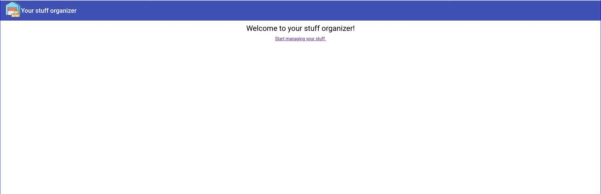
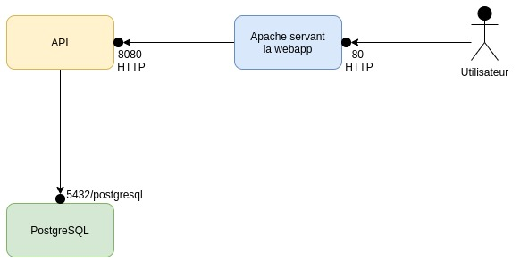

# Description
L'application est composée d'une API(écrite en Java/Spring-boot) et d'une application web (écrite en typescript/Angular).
Elle stocke ses données dans une base de données Postgresql 11+.

# Usage

L'application sert à gérer une liste d'affaires.


# Architecture
Voici un schéma d'architecture de l'application.



# API
## Construction logicielle
Pour construire l'application, il faut utiliser *maven*. 

```
$ cd api
$ mvn package
```

Cette commande produira un fichier jar qui sera éxécutable via Java. 

```
$ cd api
$ mv target/*.jar ./app.jar
$ java -jar ./app.jar
```

## Déploiement

Les propriétés de l'API sont surchargeables notamment via des [variables d'environnement](https://docs.spring.io/spring-boot/docs/current/reference/html/spring-boot-features.html#boot-features-external-config-relaxed-binding-from-environment-variables).
Le fichier de properties est [ici](https://github.com/govpf/devops-challenge/blob/master/api/src/main/resources/application.properties).

# Application web

## Construction logicielle

Pour construire l'application web, il faut utiliser *yarn*.

```
$ cd frontend
$ yarn install
$ yarn build
```

Les fichiers Javascript/HTML/CSS seront générés dans le répertoire *dist*.
```
$ cd frontend
$ ls dist/*
```

## Déploiement

L'application web doit être servie par un serveur web (Apache).
Afin d'éviter les problèmes de CORS, il est conseillé de se servir d'apache comme proxy pour les connexions frontend -> backend. 
Par exemple, en configurant Apache pour rediriger les requêtes sur '/api' vers le backend. Puis en utilisant cette url dans le frontend.
